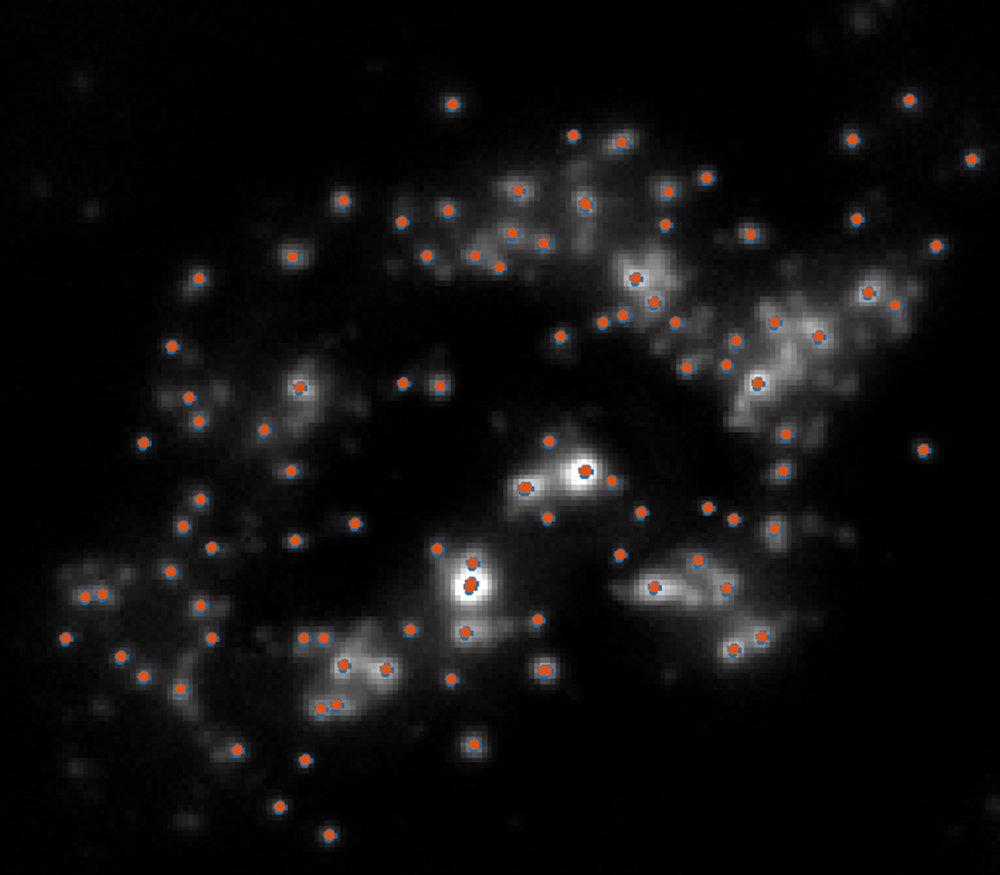

SeqFISH and smFISH data processing using SAMAEL pipeline
=============================

This guide has been written to efficiently pre-process single molecular (sm) or sequential (seq) FISH datasets using the SeqFISH AutoMAtEd Lightweight (**SAMAEL**) pipeline. In addition, basic Immuno Fluorescence (IF) staining data analysis can be performed. We strongly recommend the user to read the paper as well as the mathematical appendix before running any analysis.


Installation of the required softwares, packages and database
-----------------------------------------------

This code has been tested on MacOS High Sierra and Ubuntu 18.0.4 but not in Windows.

We recommend the users to use powerful and dedicated work stations and not personal laptops due to the high computation power and memory required for analysis. SAMAEL can perform some of the image processing steps on Nvidia Graphical Processing Units (GPUs). In the case of a Linux platform, users have to install the specific required GPU drivers.

Several softwares and packages need to be installed :

1. The first step is to install [**R software**] (https://www.r-project.org/). Once this is done, the **spatstat** package has to be installed too. The package is directly available on the [CRAN server] (https://CRAN.R-project.org/package=spatstat). 
- [**Matlab**] (https://www.mathworks.com) has to be installed, as well as the [**Image processing toolbox**] (https://www.mathworks.com/products/image.html). We recommend using Matlab 2017 or a more recent version to avoid any compatibility issue.
- While not strictly required, we recommend to download and use the excellent tool [**Fiji**] (https://imagej.net/Fiji) to visualize and check the data before analyzing them.

Installation of the pipeline
--------------------------------------

To install the pipeline, simply download it from our [Github repository] (https://github.com/PierreBSC/Pipeline-SeqFISH). Unzip it and open Matlab. Click on the **Set Path** button and then on the **Add button** to select the unzipped directory before saving (**Save button**) . If this is not working, change the working directory and select the pipeline directory.


Image data formatting and organization
-----------------------------------------------

Before running SAMAEL, the data need to be organized in a precise manner to allow fully automated data processing. First the data are split in different folders corresponding to the different **imaging rounds**. In each round folder, data are again split into different folder corresponding to the different **imaging position**. In each of these position folder, **.png** files are stored, with each **.png** file corresponding to all the z-stacks of one imaging channel. In the case of large datasets, we recommend to use **Fiji** macro.


**Warnings** : the directories names need to be correctly written. All round directories have to be named 'Round_k' and position directories 'Position_k'.

Objects creation and parameters setting
-----------------------------------------------

Before going any further in the pi

The analysis always start by creating two key objects/variables :
- The Parameters object, that contains the values of all parameters used during the analysis.
- The Analysis_result, that stores the results of all performed analysis. It is of course initially empty.

Both objects are created using the Create_experiment function :

```matlab
[Analysis_result,Parameters] = Create_experiment();
```
Launching this function will initiate a simple graphical interface with five successive windows, one per type of parameters :

1. First provide the **location of the image directory**. 


2. Then use the second window to define the **general and spot detection parameters**.  First set up basic parameters including : the number of positions, the use of GPU to increase computing speed, if only a specific set of stacks should be used and if background should be removed using gaussian smoothing. For more details please look at the table listing all parameters and their effect. In all cases, be sure to adjust for the number of positions : by default only the first position will be processed
 
3. On the same window, you can select the paremeters for the spot detection step. Two different spots detection method can be used : the  **Multiscale** and the **H-dome** spot detection methods. For an extensive comparison of the two methods please read the mathematical appendix.  The parameters of both methods can be tuned but we strongly recommend the user to start with default paramters to reduce over-fitting. 

3. The third window will contains the cell segmentation parameters. Again, default parameters will perform reasonably well in most of the cases and a detailed description of the parameters can be found at the end of this guide.  

4. Lastly, the fourth and fifth windows allow you to provide the experimental design to the pipeline. First set the number of rounds and channels. The fifth window will then open and contains a matrix where the rows correspond to the rounds and the columns the channels. By default all channels/rounds combinations will be considered as generating smFISH-like data and have a **RNA** label. To modify the kind of data, replace the RNA label by the **DAPI** or **IF** label for DAPI and Immunofluorescence data respectively. If a channel is not used at a given round put any other character string of your choice. 


Here for instance the first channel will first considered as DAPI channel, then not used for the second round and finally considered as an IF channel while all other channels are first considered as RNA staining on the two first rounds before being processed as IF channels on the last round.

Performing spot detection
-----------------------------------------------

You can now launch the spot detection :

```matlab
Analysis_result = Spot_detection(Analysis_result,Parameters);
```

This function will detect the RNA spots of the different position across rounds and channels. This can take some time if many positions have to be processed.

Once the analysis is over you can check the results using a simple visualization function. 
Let's say you want to look at the spots detection analysis performed on a given position and for a given channel and round, you simply need to run :

```matlab
Analysis_result = Spot_visualisation(Analysis_result,Parameters,2,1,4);
```
This command will project the position of the identified spots on a mean z-stack intensity projection allowing to evaluate the sensitivity and specificity of the spot detection method.
In the example given, the spots and image come from position 2, round 1 and channel 4, as specified in the function.

 

When using this function, spots that passed  the spatial filtering step are represented as red filled dots while those which did not pass it appear as blue circles.

If the analysis did not perform well you can simply change the parameters by accessing the different fields of the **Parameters** object. For instance if you want to increase the treshold offset used in the Multiscale algorithm to 0.1  and relaunch the analysis simply write :

```matlab
Parameters.T_offset= 0.1;
Analysis_result = Spot_detection(Analysis_result,Parameters);
```

Generating Quality Control plots for the spot  detection analysis
-----------------------------------------------

SAMAEL allows you to automatically generate QC plots to check for the efficiency and reproducibility across Positions of the spot detection step. To do so use the **Compute_spots_QC** function :

```matlab
Parameters = Compute_spots_QC(Analysis_result,Parameters);
```
If you never run this function before, you will have to provide the path to your output directory. Once all data required for the QC generation are collected (this might take some time as a local noise estimation is required for each spot), a pdf file called **QC_spots.pdf** will be created in the output directory.


Automated segmentation of the cells
-----------------------------------------------

Now that the RNA molecules have been detected, we can use their location to infer cell borders and shape. To do so, simply write :

```Matlab
Analysis_result = Spot_based_segmentation(Analysis_result,Parameters);
```
Again, a window will appear and ask the user to provide the list of channels to use for cell segmentation :

 

By default all (RNA) channels will be used for segmentation (**Use** label) but here only the second and fourth channels are selected. To deselect a channel just input any string 

Indeed, all genes cannot be used for cell segmentation as some of them are too faintly or too homogeneously expressed across the cells. For instance using T-cell gene markers to segment cells inside the T-cell zone of the lymph node will produce low quality segmentation.

The results of the segmentation can be visualized as easily as the results of the spot detection step :

```matlab
Segmentation_visualisation(Analysis_result,Parameters,2,1,4);
```
Here the two last numerical values is only important to select the channel and round used as a background data as different channels are used for cell segmentation.

 
Similarly to the spot detection step, parameters can be changed to improve the cell segmentation quality.

```matlab
Parameters.T = 100;
Analysis_result = Spot_based_segmentation(Analysis_result,Parameters);
```

Computing single-cell information table 
-----------------------------------------------

The last step of the processing consist in computing the number of RNA molecules of each gene for the different identified cells across all positions. This can be done by typing :

```matlab
[Analysis_result, RNA_table] = Compute_cell_RNA_expression(Analysis_result,Parameters);
```
This function will create a table object where each row corresponds to a cell and each column to a gene. 

 

This table will automatically be saved as a tab delimitated text file called **RNA_expression_table.txt** in the output directory. If you have not already provided the output directory path, the function will automatically ask you to do so.

During the analysis, each cell will receive an ID (the row names of the table) describing the number of the cell for its given position, followed by the position it comes from. 'Cell_4_P_2' will therefore correspond to the fourth cell of position 2.

A similar function exists to compute the mean IF signal for each IF channel, on a cell by cell basis :

```matlab
[Analysis_result, IF_table] = Compute_cell_fluorescence(Analysis_result,Parameters,'IF');
```
Again it will automatically export the data in the ouptut directory as **IF_expresssion_table.txt**.

Lastly the features of the cells that are not directly related to gene expression have to computed :

```matlab
Cell_properties = Compute_cell_properties(Analysis_result,Parameters);
```
Those informations are :

1. Cell position
2. Cell size 
3. Mean DAPI staining intensity. 
4. Total number of RNA spots detected in that cell.


This table will also be saved in the ouput directory as 
